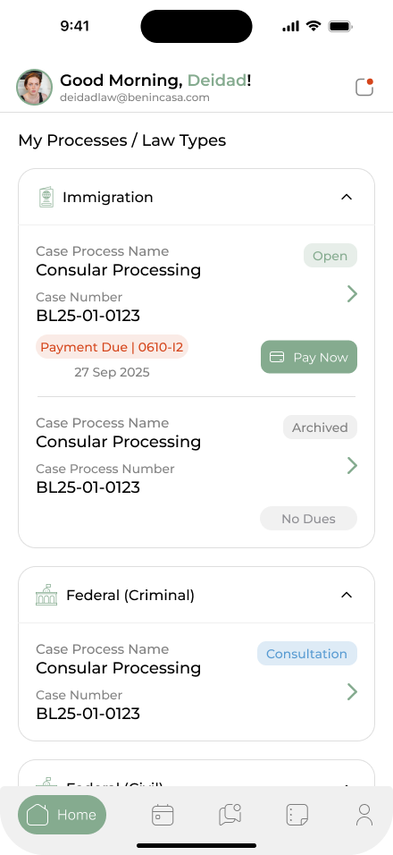

# BenkaLaw Client - React Native Application

Welcome to the official mobile application for clients of BenkaLaw. This application is built with React Native and serves as a comprehensive portal for clients to interact with their legal team, stay updated on their case progress, and manage all related activities in one place.

## ✨ Key Features

The application provides a robust set of features designed to streamline the client-lawyer relationship:

-   **Secure Authentication:** Clients can log in securely to access their private dashboard. The app features a persistent login with automated token refresh for a seamless user experience.
-   **Case Management:** A detailed view of all active and past legal cases. Clients can track the status, review documents, and see a timeline of events for each case.
-   **Direct Messaging:** An integrated, real-time chat feature allows clients to communicate directly and securely with their assigned legal team, reducing the need for emails and phone calls.
-   **Calendar & Reminders:** An interactive calendar displays all upcoming appointments, court dates, and deadlines. Automated reminders ensure clients never miss an important event.
-   **Push Notifications:** Powered by Firebase Cloud Messaging (FCM), the app sends instant notifications for new messages, case status updates, and upcoming appointments.
-   **Profile Management:** Clients can view and manage their personal information, ensuring all contact details are up-to-date.
-   **Secure Payments:** A dedicated section for handling legal fees. Clients can view invoices and make payments directly through the application.

## 📸 Screenshots

To add screenshots, create a folder at `assets/screenshots` in the root of the project. Add your images there, and then embed them here using Markdown. It is recommended to use images with a width of around 300px for a clean layout.

| Login Screen                               | Home Screen                                |
| ------------------------------------------ | ------------------------------------------ |
|  |  |


---

## 🛠️ Technology & Architecture

This project leverages a modern and scalable tech stack to deliver a high-quality native experience.

### Core & UI
-   **React Native:** The core framework for building cross-platform (iOS & Android) applications from a single JavaScript/TypeScript codebase.
-   **TypeScript:** Ensures type safety, leading to more robust code and a better developer experience.
-   **React Native Vector Icons:** Provides a rich library of customizable icons.
-   **React Native SVG:** Used for rendering high-quality, resolution-independent vector graphics.

### Navigation
-   **React Navigation:** The primary navigation library, used to create a smooth, native-like navigation experience. It implements a `StackNavigator` for primary screen transitions and a `BottomTabNavigator` for the main app interface.

### API & Data Handling
-   **Axios:** A promise-based HTTP client for making requests to the backend API.
-   **Automated Token Refresh:** The Axios client is configured with interceptors to handle API authentication seamlessly. It automatically attaches the JWT access token to requests and, upon a `401 Unauthorized` response, uses the refresh token to fetch a new access token and retry the failed request without interrupting the user.
-   **AsyncStorage:** Used for persisting client-side data such as authentication tokens and user details across app sessions.

### Styling
-   **Centralized Theme:** The UI is styled using a centralized theme defined in `src/constants/theme`. This includes predefined color palettes, spacing, border-radius, and typography scales.
-   **Responsive Sizing:** The app uses `react-native-size-matters` to create a responsive UI that scales gracefully across different device sizes and resolutions.

### Tooling & Quality
-   **ESLint:** For static code analysis to find and fix problems in the codebase.
-   **Prettier:** An opinionated code formatter to ensure a consistent code style across the project.
-   **Jest:** The testing framework used for writing unit and integration tests.

---

## 📂 Detailed Project Structure

The project is organized to be scalable and maintainable. The `src` directory is the heart of the application.

```
BenkaLaw-Client/
├── android/              # Android native project files
├── ios/                  # iOS native project files
└── src/
    ├── assets/           # Static assets: images, fonts, logos, and icons
    ├── components/         # Reusable, shared UI components (e.g., CustomTextInput, CustomBottomTab)
    ├── constants/          # Global constants and theme configuration
    │   ├── colors.ts       # App-wide color palette
    │   └── theme/          # UI theme (spacing, metrics, typography)
    ├── navigation/         # Navigation logic, route definitions, and stack configurations
    ├── Screens/            # All application screens, organized by feature/module
    │   ├── auth/           # Authentication screens (Login)
    │   ├── Main/           # Screens available after login (Home, Chat, Profile, etc.)
    │   └── splash/         # The initial splash screen
    └── utils/              # Utility functions and helpers
        ├── asyncStorage.js # Abstraction for AsyncStorage
        ├── http.common.js  # Axios instance configuration and interceptors
        ├── toastUtils.js   # Configuration for toast notifications
        └── Validations.js  # Input validation functions
```

---

## 🚀 Getting Started

### 1. Prerequisites
-   Node.js (>=20.x.x)
-   A configured React Native development environment. Follow the official [React Native Environment Setup guide](https://reactnative.dev/docs/environment-setup) for your specific OS.
-   Xcode (for iOS) & Android Studio (for Android).

### 2. Environment Setup
For the application to connect to backend services and receive push notifications, you must configure the environment.

-   **Android:** Place your Firebase `google-services.json` file in the `android/app/` directory.
-   **iOS:** Open the project in Xcode. In the `BenkaLawClient` target, add your `GoogleService-Info.plist` file.
-   **API Endpoint:** The backend API endpoint is currently hardcoded in `src/utils/http.common.js`. It is recommended to move this to an environment file (e.g., `.env`) for easier configuration.

### 3. Installation & Running
1.  **Clone the repository:**
    ```sh
    git clone <repository-url>
    cd BenkaLaw-Client
    ```

2.  **Install dependencies:**
    ```sh
    npm install
    ```

3.  **Link custom fonts and assets:**
    ```sh
    npx react-native-asset
    ```

4.  **For iOS, install pods:**
    ```sh
    cd ios && pod install && cd ..
    ```

5.  **Start the Metro bundler:**
    ```sh
    npm start
    ```

6.  **Run on a simulator or device:**
    -   **Android:** `npm run android`
    -   **iOS:** `npm run ios`

---

## 🧪 Testing

The project uses Jest for testing. Test files are located in the `__tests__` directory.

-   **To run all tests:**
    ```sh
    npm test
    ```

---

## 📜 Available Scripts

-   `npm run android`: Deploys the app to an Android emulator or connected device.
-   `npm run ios`: Deploys the app to an iOS simulator or connected device.
-   `npm start`: Starts the Metro development server.
-   `npm test`: Executes all tests with Jest.
-   `npm run lint`: Lints all project files with ESLint.
